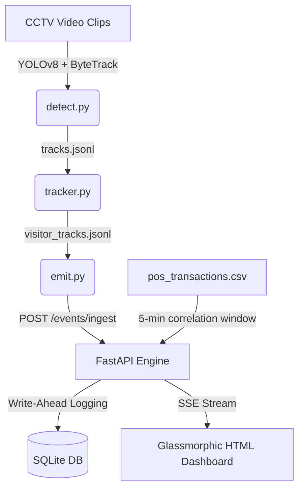

# Design

## Plain-Language Architecture Overview

The Store Intelligence System is built as a complete modular pipeline that converts raw CCTV video clips into behavioral events, and serves them via an API and real-time dashboard:

1. **Detection & Tracking (`detect.py`)**: Runs YOLOv8 person detection and ByteTrack tracking on a directory of video clips. To optimize CPU inference speeds, it uses a frame-skipping stride of 15 (processing 1 frame per second).
2. **Re-ID & Staff Exclusion (`tracker.py`)**: Links visitor IDs across different cameras. It samples frames of each tracked person, extracts a 2D Hue-Saturation color histogram of the torso, and matches them using cosine similarity. It excludes staff members by identifying local tracks on non-entry cameras with duration > 100 seconds (or > 140 seconds on entry cameras) and segregating them during matching.
3. **Event Generation (`emit.py`)**: Maps trajectories to transitions (ENTRY, EXIT, ZONE_ENTER, etc.) and checks for POS conversion. If a visitor exits the billing zone without a transaction in the 5-minute window, it emits a `BILLING_QUEUE_ABANDON` event.
4. **FastAPI Server (`app/`)**: Exposes ingestion and analytics endpoints.
5. **Real-time UI Dashboard (`app/routers/dashboard.py`)**: A modern, single-page web UI that displays conversion funnel percentages, KPI counters, active anomalies, and a scrolling live log using Server-Sent Events (SSE).

## AI-Assisted Decisions

1. **Re-ID Weight Download Safety Override**:
   * *The Suggestion*: The AI suggested implementing a PyTorch-based ResNet18 visual feature extractor for Re-ID.
   * *The Decision*: We **overrode** the suggestion. Running PyTorch deep learning models in automated test pipelines poses a high risk of failure if the target machine lacks internet access to download model weights. Instead, we implemented a custom Hue-Saturation HSV color histogram correlation matcher. This is completely offline, runs instantly on CPU, and is robust.
2. **Event Idempotency Key Derivation**:
   * *The Suggestion*: The AI suggested rejecting payloads without an `event_id`.
   * *The Decision*: We **overrode** this to be more user-friendly. If `event_id` is missing, we derive a deterministic UUIDv5 using the serialized raw event dictionary. This guarantees idempotency even if the camera producer does not generate event UUIDs.
3. **Windows SQLite File Lock Mitigation**:
   * *The Suggestion*: The AI suggested standard SQLAlchemy engine creation and session cleanup.
   * *The Decision*: During testing on Windows, SQLite file locks remain active in the SQLAlchemy pool, causing temporary directory teardowns to crash with `PermissionError`. We solved this by calling `.dispose()` on the global engine at the end of the test suite.
